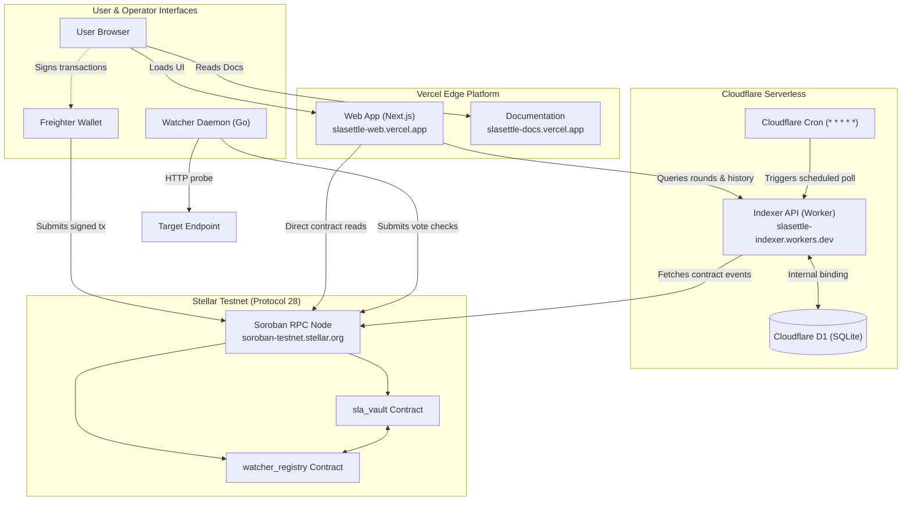

<div align="center">


# SLASettle Hub

Web application, SDK, indexer, watcher tooling, and documentation for SLASettle on Stellar.

[](https://github.com/SLASettleHQ/slasettle-hub/actions/workflows/ci.yml)
[](LICENSE)
[](https://slasettle-web.vercel.app)
[](https://slasettle-docs.vercel.app)
[](https://slasettle-indexer.slasettle-indexer.workers.dev)
[](https://stellar.org)
[](https://github.com/SLASettleHQ/slasettle-hub/tree/main)

[Live App](https://slasettle-web.vercel.app) · [Documentation](https://slasettle-docs.vercel.app) · [Hosted Indexer](https://slasettle-indexer.slasettle-indexer.workers.dev) · [SLASettle Vault](https://github.com/SLASettleHQ/slasettle-vault) · [Evidence Index](evidence/index.md) · [Security](SECURITY.md) · [Contributing](CONTRIBUTING.md)

</div>

---

## What is SLASettle Hub?

SLASettle Hub provides the complete client, developer, and indexing infrastructure for the SLASettle protocol on Stellar. While the Soroban smart contracts live in [SLASettle Vault](https://github.com/SLASettleHQ/slasettle-vault), this workspace contains all off-chain software required to interact with, monitor, and inspect bonded service-level agreements:

- **Web Dashboard (`apps/web`)**: A Next.js application providing a public landing page, interactive SLA creation and lifecycle management, wallet-connected dashboards, and indexer-backed round status displays.
- **TypeScript SDK (`packages/sdk`)**: A typed client library providing contract bindings, unsigned transaction construction, Horizon/RPC utilities, and SEP-41 token interactions.
- **Event Indexer (`indexer`)**: A Node.js and Cloudflare Workers service that ingests contract events, persists round history and tallies into Cloudflare D1 (SQLite), and exposes a read-only HTTP API.
- **Watcher Daemon (`watcher`)**: An independent Go daemon that executes periodic HTTP health probes against monitored endpoints and signs and submits vote checks to `watcher_registry`.
- **Documentation (`apps/docs`)**: A VitePress documentation site detailing protocol concepts, deployment topologies, contract specifications, and verification evidence.

## Why it exists

Smart contracts provide custody and settlement guarantees, but operators and customers need off-chain interfaces to use them:
- Providers need a clear interface to create SLAs, deposit and top up token bonds, and track agreement health.
- Customers and beneficiaries require independent verification of endpoint status without relying on provider self-reporting.
- Watcher nodes need lightweight, robust daemon software to run checks and submit transactions reliably without handling custodian funds.
- Web clients require efficient event caching and round aggregation rather than repeatedly polling complex raw RPC logs.

## Live Testnet status

| Service | Host | Status | Details |
|---|---|---|---|
| Web Application | Vercel | [Live App](https://slasettle-web.vercel.app) | Connected to Testnet RPC and Hosted Indexer |
| Documentation | Vercel | [Documentation](https://slasettle-docs.vercel.app) | Architecture, guides, and evidence |
| Hosted Indexer API | Cloudflare Workers | [Indexer API](https://slasettle-indexer.slasettle-indexer.workers.dev) | Backed by Cloudflare D1 (SQLite) |
| Watcher Daemon | Local / Operator-run | Operational | Independent Go binary; test rounds maintainer-driven |
| Target Network | Stellar Testnet | Connected | RPC at `https://soroban-testnet.stellar.org` |
| Contracts Repo | GitHub | [slasettle-vault](https://github.com/SLASettleHQ/slasettle-vault) | Protocol 28 contracts (`sla_vault`, `watcher_registry`) |

## Components

```
apps/web          Next.js frontend: landing page, wallet-gated dashboard,
                  per-SLA status and agreement management
packages/sdk      TypeScript contract bindings and transaction builders;
                  unsigned envelopes only, never holds private keys
indexer           Cloudflare Worker / Node service indexing contract events
                  into D1 / SQLite with read-only REST API
watcher           Independent Go daemon probing endpoints and submitting
                  watcher votes to watcher_registry
apps/docs         VitePress documentation site covering architecture,
                  operational runbooks, and verification evidence
```

`apps/web` and `packages/sdk` share a single pnpm workspace at repository root (`pnpm-workspace.yaml`). `indexer` is an npm project with its own lockfile. `watcher` is a standalone Go module.

## Features

- **On-Chain SLA Creation**: Providers configure recipient beneficiaries, uptime target indicators, observation round lengths, and lock real collateral tokens.
- **Direct RPC Contract Reads**: The web application reads authoritative bond balances and SLA metadata directly from Soroban RPC via `@slasettle/sdk`.
- **Indexer-Backed Round Analytics**: Cloudflare D1 stores historical round votes, tallies, and past settlement events for instant dashboard inspection.
- **Non-Custodial Wallet Integration**: Integrates Freighter wallet for user-signed transactions; private keys never leave the user's browser.
- **Independent Health Probes**: The Go watcher daemon operates with its own signing key, submitting round checks without custody over any agreement funds.

## Architecture

The production hosting topology verified in Phase 9 separates user interaction, scheduled indexing, and on-chain settlement:



## Verification status

| Verification Class | Scope | Evidence |
|---|---|---|
| Live Verified | Create SLA, top-up bond, cancel SLA, withdraw remaining bond, direct contract reads, hosted indexer API | [Phase 7 Live Write Evidence](evidence/phase7-live-write-verification-2026-10-07.md) |
| Hosted Browser Verification | Real browser with Freighter extension on deployed Vercel origin | [Deployed Verification 2026-10-07](evidence/deployed-verification-2026-10-07.md) |
| Toolchain & WASM Parity | Byte-for-byte local/deployed WASM hash match on Protocol 28 | [Phase 8 Toolchain & Deployment](evidence/phase8-toolchain-deployment-verification-2026-10-07.md) |
| Hosting & Topology | Service boundaries, network paths, CORS policies, secrets audit | [Phase 9 Hosting Topology](evidence/phase9-hosting-topology-verification-2026-10-07.md) |
| Historical Settlement | On-chain settlement transaction on Testnet | [Testnet Evidence 2026-10-01](https://github.com/SLASettleHQ/slasettle-vault/blob/main/evidence/testnet-2026-10-01.md) |
| Test Covered | Wallet rejection paths, unconfirmed transaction states, mock settlement | `pnpm run test` (SDK & Web), `npm test` (Indexer), `go test` (Watcher) |
| Partial / Unverified | Real-device mobile touch testing, OS-level `prefers-reduced-motion` | Deferred operational observation |

## Quick start

```bash
# Install SDK and Web dependencies
pnpm install

# Build SDK and Web app
pnpm run build

# Run local development server
pnpm --filter web dev
```

Toolchain versions verified:
- Node.js `24.21.0` (`.nvmrc`)
- pnpm `12.8.2`
- Go `1.25.x` (`watcher/go.mod`)

## Environment variables

### `apps/web/.env.example`
```text
NEXT_PUBLIC_SOROBAN_RPC_URL=https://soroban-testnet.stellar.org
NEXT_PUBLIC_NETWORK_PASSPHRASE=Test SDF Network ; September 2015
NEXT_PUBLIC_SLA_VAULT_CONTRACT_ID=CDBFPYHJNYSIFXSMXF3BBDWPKHRS7SJFFEKMQ5WJXYTBMD4LFAG2CHLN
NEXT_PUBLIC_WATCHER_REGISTRY_CONTRACT_ID=CDRNXUPCZTVZXKPWNBQZAYI6HYFNBDHRO2KNNJSMDVTEHFOM7LCMOYMF
NEXT_PUBLIC_INDEXER_API_URL=https://slasettle-indexer.slasettle-indexer.workers.dev
```

### `indexer/.env.example`
```text
WATCHER_REGISTRY_CONTRACT_ID=CDRNXUPCZTVZXKPWNBQZAYI6HYFNBDHRO2KNNJSMDVTEHFOM7LCMOYMF
SLA_VAULT_CONTRACT_ID=CDBFPYHJNYSIFXSMXF3BBDWPKHRS7SJFFEKMQ5WJXYTBMD4LFAG2CHLN
RPC_URL=https://soroban-testnet.stellar.org
NETWORK_PASSPHRASE=Test SDF Network ; September 2015
ALLOWED_ORIGINS=https://slasettle-web.vercel.app,http://localhost:3000
```

### `watcher/.env.example`
```text
WATCHER_REGISTRY_CONTRACT_ID=CDRNXUPCZTVZXKPWNBQZAYI6HYFNBDHRO2KNNJSMDVTEHFOM7LCMOYMF
WATCHER_SECRET_KEY=S...
TARGET_URL=https://example.com/health
SLA_ID=0
RPC_URL=https://soroban-testnet.stellar.org
NETWORK_PASSPHRASE=Test SDF Network ; September 2015
```

## Build and test

```bash
# SDK and Web
pnpm run build
pnpm run lint
pnpm run typecheck
pnpm run test

# Indexer
cd indexer && npm ci && npm run build && npm test && cd ..

# Watcher
cd watcher && go build ./... && go vet ./... && go test ./... && cd ..
```

## Deployment

- **Web Frontend**: Hosted on Vercel with production environment variables matching `.env.example`.
- **Documentation**: Hosted on Vercel from `apps/docs`.
- **Indexer**: Hosted on Cloudflare Workers with a bound Cloudflare D1 database and 1-minute cron triggers.
- **Watcher Daemon**: Run as a systemd service, container, or standalone background process by independent operators.

Detailed hosting topologies and network paths are documented in [`evidence/phase9-hosting-topology-verification-2026-10-07.md`](evidence/phase9-hosting-topology-verification-2026-10-07.md).

## Continuous integration

`.github/workflows/ci.yml` runs three jobs on every push and pull request against `main`:
1. `web and sdk (build, lint, typecheck, test)`
2. `indexer (build, test)`
3. `watcher (build, vet, test)`

Branch protection requires pull requests and passing status checks across all three CI jobs. Required approving reviews are currently set to 0 for small-team velocity. Protection is not enforced for repository administrators (`enforce_admins` is off), allowing direct administrative resolution if required.

Dependabot (`.github/dependabot.yml`) checks `npm` (root workspace and `indexer`), `gomod` (`watcher`), and `github-actions` weekly.

## Security and privacy

See [`SECURITY.md`](SECURITY.md).

**This project has not undergone an independent third-party security audit.**

- **Key Management**: `@slasettle/sdk` and `apps/web` never request, store, or log secret keys. All transaction signing is delegated to user-controlled wallet extensions (Freighter).
- **Watcher Secrets**: `WATCHER_SECRET_KEY` is loaded strictly from environment configuration and is never logged or exposed.
- **CORS Policies**: The hosted indexer enforces an explicit origin allowlist (`ALLOWED_ORIGINS`) and rejects unauthorized origins.

## Known limitations

1. **Frontend-Driven Settlement**: A frontend-driven `trigger_settlement` was not submitted in the Phase 7 pass because no genuine unsettled quorum-reached round existed on Testnet, and no artificial votes were fabricated.
2. **Watcher Decentralization**: In the current Testnet demonstration, watcher addresses were initialized and tested by project maintainers rather than a distributed set of independent third-party operators.
3. **Network Mismatch Guards**: The web interface blocks write operations when the connected wallet is on a different network than configured; verified with unit tests and simulated wallets.
4. **Physical Device Touch Testing**: Mobile and tablet browser flows are verified with viewport emulation; physical touch testing remains partial.

For full contract-level limitations (e.g. lack of commit-reveal vote protection), see [SLASettle Vault](https://github.com/SLASettleHQ/slasettle-vault).

## Contributing

See [`CONTRIBUTING.md`](CONTRIBUTING.md).

## License

This project is licensed under the [MIT License](LICENSE).
