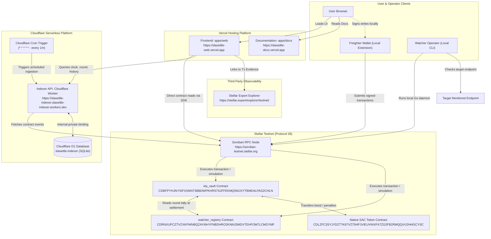

# Phase 9 Hosting and Service Topology Verification

Date: 2026-10-07  
Author: Hollujay  
Repositories:
- `SLASettleHQ/slasettle-vault` at commit `d55d4396408c328cd625b058ce9e5a980e4e9636`
- `SLASettleHQ/slasettle-hub` at commit `b72565cbb1f9a8aa80685602d576e4a4162fdd3e`

---

## 1. Objective and Scope

Phase 9 audits and proves that the production hosting topology of the SLASettle protocol is correct, understandable, reproducible, and appropriate for the actual service shapes. It documents the runtime characteristics, network connections, persistence models, environment variables, secret management, failure modes, and cost profile across all live surfaces.

---

## 2. Complete Runtime Component Inventory

| Component | Purpose | Repository & Directory | Runtime / Language | Hosting Platform | Public URL | Stateful / Stateless | Persistent Storage Requirement | Inbound / Outbound Connections | Deployment Method | Production Status |
|---|---|---|---|---|---|---|---|---|---|---|
| **Frontend** | User UI, Provider Dashboard, SLA Status | `slasettle-hub` (`apps/web`) | Node 24 / Next.js 16 (React 19) | Vercel (Hobby) | `https://slasettle-web.vercel.app` | Stateless (Edge SSR + Static Chunks) | None (Browser session only) | **In**: HTTPS users **Out**: Stellar RPC, Hosted Indexer | Vercel CLI upload | **CURRENTLY DEPLOYED** |
| **SDK** | Protocol bindings, contract client, transaction builder | `slasettle-hub` (`packages/sdk`) | TypeScript / `@stellar/stellar-sdk` | Library (in-browser & node) | N/A (bundled npm package) | Stateless | None | Embedded inside frontend and scripts | pnpm workspace build | **PACKAGED / LIVE IN APP** |
| **Hosted Indexer** | Event ingestion, round clock, historical query API | `slasettle-hub` (`indexer/`) | Cloudflare Workers (TypeScript) | Cloudflare Workers | `https://slasettle-indexer.slasettle-indexer.workers.dev` | Stateless runtime over managed D1 storage | Cloudflare D1 SQL database | **In**: HTTPS from Frontend/Clients **Out**: Stellar Testnet RPC, D1 binding | Wrangler CLI / Cloudflare API | **CURRENTLY DEPLOYED** |
| **Indexer Database** | Persisted contract events, checkpoint ledger, watcher states | `slasettle-hub` (`indexer/migrations`) | Cloudflare D1 (SQLite engine) | Cloudflare D1 | Private (Internal Worker binding only) | Stateful | D1 Serverless Storage (Tables: `checkpoint`, `watchers`, `checks`, `slas`, `settlements`) | **In**: Indexer Worker binding only **Out**: None | Wrangler migrations | **CURRENTLY DEPLOYED** |
| **Watcher Daemon** | Independent round health check and vote submission | `slasettle-hub` (`watcher/`) | Go 1.25 (`go-stellar-sdk` v0.7.3) | Locally run CLI daemon | None (no public HTTP endpoint) | Stateless process | None (ephemeral local process) | **In**: None **Out**: Target HTTP endpoints, Stellar RPC | Local `go run` / binary execution | **LOCALLY RUN / OPTIONAL** (Not hosted 24/7) |
| **SLA Vault Contract** | Bond custody, SLA lifecycle, settlement payout | `slasettle-vault` (`contracts/sla_vault`) | Rust / Soroban SDK 28.0.0 | Stellar Testnet | Contract ID: `CDBFPYHJNYSIFXSMXF3BBDWPKHRS7SJFFEKMQ5WJXYTBMD4LFAG2CHLN` | Stateful on-chain ledger | Soroban Instance & Persistent Storage | **In**: Soroban RPC invokes **Out**: Cross-contract calls to Registry & SAC | `stellar contract deploy` | **CURRENTLY DEPLOYED** |
| **Watcher Registry Contract** | Watcher whitelist, round vote tallying | `slasettle-vault` (`contracts/watcher_registry`) | Rust / Soroban SDK 28.0.0 | Stellar Testnet | Contract ID: `CDRNXUPCZTVZXKPWNBQZAYI6HYFNBDHRO2KNNJSMDVTEHFOM7LCMOYMF` | Stateful on-chain ledger | Soroban Instance & Persistent Storage | **In**: Soroban RPC invokes, Vault cross-contract calls **Out**: None | `stellar contract deploy` | **CURRENTLY DEPLOYED** |
| **Stellar Testnet RPC** | Soroban simulation, transaction submission, ledger state | External (SDF) | Horizon / Soroban RPC | SDF Infrastructure | `https://soroban-testnet.stellar.org` | Stateful ledger node | Stellar ledger storage | **In**: Frontend, Indexer, Watcher, Wallets **Out**: Stellar validator consensus | Managed by SDF | **EXTERNAL SERVICE** |
| **Freighter Wallet** | User key custody and transaction signing | External (Browser Extension) | WebExtension (JavaScript) | User Browser | Client-side extension | Local secure key store | Encrypted browser storage | **In**: User approvals **Out**: Stellar RPC / Horizon | Extension Store | **EXTERNAL EXTENSION** |
| **Documentation Site** | Protocol specifications, developer guides, topology | `slasettle-hub` (`apps/docs`) | VitePress 1.6.4 | Vercel (Hobby) | `https://slasettle-docs.vercel.app` | Stateless static site | None | **In**: HTTPS users **Out**: None | Vercel CLI upload | **CURRENTLY DEPLOYED** |
| **CI / CD Pipelines** | Automated test, build, lint, and verification | Both repos (`.github/workflows`) | GitHub Actions | GitHub Hosted Runners | GitHub repo actions | Ephemeral runner | GitHub cache | **In**: Git push/PR triggers **Out**: Package registries, Testnet reads | Git commit workflow | **ACTIVE** |

---

## 3. Production Topology Diagram

---

## 4. Verified Production Network Paths

### Path A: Direct Contract Read Path
1. **Source:** User browser loading `https://slasettle-web.vercel.app`.
2. **Hop:** `@slasettle/sdk` makes JSON-RPC `simulateTransaction` requests to `https://soroban-testnet.stellar.org`.
3. **Target:** Soroban contracts `CDBFPYHJ...` (`sla_vault`) and `CDRNXUPC...` (`watcher_registry`).
4. **Data:** Authoritative live bond balance, SLA configuration status, and settled round flags.
5. **Verified:** Confirmed live with SLA 0 (Active, bond `410000000`), SLA 1 (Cancelled, bond `0`), and SLA 2 (Cancelled, bond `0`).

### Path B: Hosted Indexer Query & Ingestion Path
1. **Query Hop:** User browser requests `https://slasettle-indexer.slasettle-indexer.workers.dev/v1/slas/0/settlements`.
2. **Worker Resolution:** Cloudflare Worker receives request, validates origin CORS, executes prepared SQL statement against Cloudflare D1.
3. **Response:** Returns JSON with aggregated round votes, quorum threshold, and transaction hashes.
4. **Ingestion Hop:** Every 60 seconds, Cloudflare Cron Trigger triggers `scheduled()`, invoking `runIngestionStep()`. Worker contacts `https://soroban-testnet.stellar.org` via `getEvents`, parses emitted events, and writes batches into D1.
5. **Verified:** Checkpoint verified active at ledger `5070374`, with round 123 settlement and provider SLAs 0, 1, 2 indexed.

### Path C: Wallet Write Path
1. **Source:** User on `https://slasettle-web.vercel.app`.
2. **Transaction Build:** SDK builds unsigned Soroban transaction with contract call invocation.
3. **Signing:** Freighter extension displays authorization popup to user; user signs with private key held locally in extension memory.
4. **Submission:** Signed transaction submitted to `https://soroban-testnet.stellar.org` via `sendTransaction`.
5. **Confirmation:** App polls `getTransaction` until status is `SUCCESS`, displaying confirmation hash and Stellar Expert link.
6. **Verified:** Confirmed live during Phase 7 for SLA #2 create, top-up, cancel, and withdraw transactions.

### Path D: Watcher Operation Path
1. **Source:** Local Go watcher process (`watcher/cmd/watcher`).
2. **Health Check:** Daemon probes target HTTP endpoint (`TARGET_URL`).
3. **Vote Submission:** Daemon signs `submit_check` transaction using funded watcher secret key and submits to `https://soroban-testnet.stellar.org`.
4. **Target:** `watcher_registry` contract records vote in round tally.
5. **Verified:** Confirmed in Phase 23 and 2026-10-06 readback passes; no standing 24/7 watcher daemon is continuously hosted.

### Path E: Explorer Verification Path
1. **Source:** Frontend or Indexer produces Stellar Expert explorer links (`https://stellar.expert/explorer/testnet/tx/<hash>`).
2. **Target:** Public third-party ledger explorer verifies on-chain ledger inclusion, fee dissipation, and operation results.

---

## 5. Production CORS and Origin Policy

Tested and verified directly against the production Cloudflare Worker (`https://slasettle-indexer.slasettle-indexer.workers.dev/v1/health`):

| Request Origin | Response `access-control-allow-origin` | Status | Behavior |
|---|---|---|---|
| `https://slasettle-web.vercel.app` | `https://slasettle-web.vercel.app` | Allowed | Returns exact allowed origin; credentials disabled; `Vary: Origin` set |
| `http://localhost:3000` | `http://localhost:3000` | Allowed | Returns exact allowed origin for local development |
| `https://malicious.example.com` | *(None)* | Blocked | Cross-origin request rejected by browser; no wildcard `*` returned |
| `OPTIONS` Preflight | `https://slasettle-web.vercel.app` | 204 No Content | Valid preflight headers: `GET, HEAD, OPTIONS`, `Content-Type` |

---

## 6. Production Environment Variable Topology

| Variable | Target Service | Visibility | Lifecycle | Configured Location | Source of Truth | Value Status |
|---|---|---|---|---|---|---|
| `NEXT_PUBLIC_SOROBAN_RPC_URL` | Frontend (`apps/web`) | Public | Build-time | Vercel Environment | `https://soroban-testnet.stellar.org` | SET |
| `NEXT_PUBLIC_NETWORK_PASSPHRASE` | Frontend (`apps/web`) | Public | Build-time | Vercel Environment | `Test SDF Network ; September 2015` | SET |
| `NEXT_PUBLIC_SLA_VAULT_CONTRACT_ID` | Frontend (`apps/web`) | Public | Build-time | Vercel Environment | `CDBFPYHJNYSIFXSMXF3BBDWPKHRS7SJFFEKMQ5WJXYTBMD4LFAG2CHLN` | SET |
| `NEXT_PUBLIC_WATCHER_REGISTRY_CONTRACT_ID` | Frontend (`apps/web`) | Public | Build-time | Vercel Environment | `CDRNXUPCZTVZXKPWNBQZAYI6HYFNBDHRO2KNNJSMDVTEHFOM7LCMOYMF` | SET |
| `NEXT_PUBLIC_INDEXER_API_URL` | Frontend (`apps/web`) | Public | Build-time | Vercel Environment | `https://slasettle-indexer.slasettle-indexer.workers.dev` | SET |
| `RPC_URL` | Hosted Indexer | Public | Runtime | `wrangler.jsonc` `vars` | `https://soroban-testnet.stellar.org` | SET |
| `NETWORK_PASSPHRASE` | Hosted Indexer | Public | Runtime | `wrangler.jsonc` `vars` | `Test SDF Network ; September 2015` | SET |
| `WATCHER_REGISTRY_CONTRACT_ID` | Hosted Indexer | Public | Runtime | `wrangler.jsonc` `vars` | `CDRNXUPCZTVZXKPWNBQZAYI6HYFNBDHRO2KNNJSMDVTEHFOM7LCMOYMF` | SET |
| `SLA_VAULT_CONTRACT_ID` | Hosted Indexer | Public | Runtime | `wrangler.jsonc` `vars` | `CDBFPYHJNYSIFXSMXF3BBDWPKHRS7SJFFEKMQ5WJXYTBMD4LFAG2CHLN` | SET |
| `START_LEDGER` | Hosted Indexer | Public | Runtime | `wrangler.jsonc` `vars` | `4963530` | SET |
| `ROUND_LENGTH_SECONDS` | Hosted Indexer | Public | Runtime | `wrangler.jsonc` `vars` | `60` | SET |
| `ALLOWED_ORIGINS` | Hosted Indexer | Public | Runtime | `wrangler.jsonc` `vars` | `https://slasettle-web.vercel.app,http://localhost:3000` | SET |
| `DB` | Hosted Indexer | Private Binding | Runtime | Cloudflare D1 Binding | Database ID: `c45540af-2fb9-4092-a771-c34b0b4a4e69` | BOUND |
| `WATCHER_SECRET_KEY` | Watcher Daemon | Secret | Runtime | Local process environment only | Operator local key store | NOT SET in repo |

---

## 7. Secret Management Audit

A comprehensive scan of both repositories confirmed:
1. **Zero Private Keys Committed:** `git grep -E "S[A-Z0-9]{55}"` returned 0 matches in both `slasettle-hub` and `slasettle-vault`.
2. **Zero Wallet Secrets in Bundles:** Inspected Vercel client bundle chunks; no private key, seed phrase, or authentication secret is present.
3. **No Database Credentials:** Cloudflare D1 uses internal Worker bindings (`env.DB`), completely eliminating database passwords or external connection URIs.
4. **Gitignore Integrity:** `.env`, `.env.local`, `.deployed-testnet.env`, and build directories are strictly ignored in `.gitignore`.

---

## 8. Failure Modes and Resilience Review

- **Vercel Frontend:**
  - *Build Failure:* Statically validated via TypeScript and lint prior to deployment.
  - *RPC Outage:* UI displays network indicator as "Unavailable" and exposes clear error notices rather than crashing.
  - *Indexer Outage:* Frontend degrades gracefully; direct contract reads (bond balance, SLA status) remain functional.
- **Hosted Indexer:**
  - *RPC Failure during Ingestion:* Scheduled cron skips tick without advancing checkpoint; resumes cleanly on subsequent tick.
  - *Database Writes:* Handled atomically in `IndexerD1.applyBatch`; partial batches are rolled back.
  - *Origin Mismatch:* Unrecognized origins are refused CORS headers without application errors.
- **Watcher Daemon:**
  - *Daemon Offline:* Watcher does not submit check; round continues until close time. Quorum requirement prevents improper breach settlement.

---

## 9. Cost and Free-Tier Profile

All hosted services currently operate within platform free tiers at **$0.00/month**:
- **Vercel Hobby Plan:** Generous free bandwidth (100 GB/mo) and serverless function executions.
- **Cloudflare Workers Free Tier:** Includes 100,000 daily Worker requests, 5,000,000 daily D1 reads, and 100,000 daily D1 writes. The 1-minute cron uses 1,440 requests/day (~1.4% of limit).
- **Stellar Testnet RPC:** Free community infrastructure provided by SDF.

---

## 10. Service-Shape Decisions

- **Frontend (`apps/web`):** **KEEP CURRENT HOST (Vercel)**. Next.js App Router static optimization and Edge deployment align with Vercel capabilities.
- **Indexer (`indexer/`):** **KEEP CURRENT HOST (Cloudflare Workers + D1)**. Serverless edge API with scheduled cron ingestion and collocated D1 SQL storage satisfies the query and cost requirements without long-running server overhead.
- **Contracts:** **KEEP CURRENT HOST (Stellar Testnet)**. Live on Soroban Testnet.
- **Watcher Daemon (`watcher/`):** **NOT HOSTED / INTENTIONALLY LOCAL**. Independent Go CLI for decentralized operators. Maintaining a single centralized continuous watcher server in Phase 9 is unnecessary and violates watcher independence principles.
- **Documentation (`apps/docs`):** **KEEP CURRENT HOST (Vercel)**. Static VitePress documentation hosted at zero cost.

---

## 11. Final Phase 9 Verdict

**PHASE 9: PASS**
